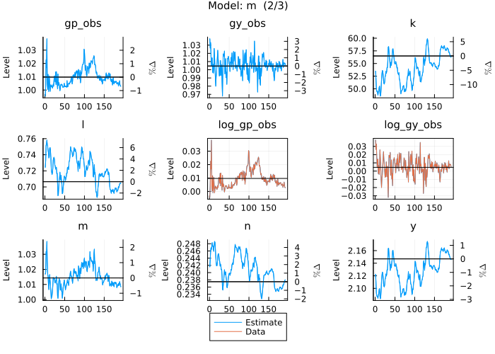
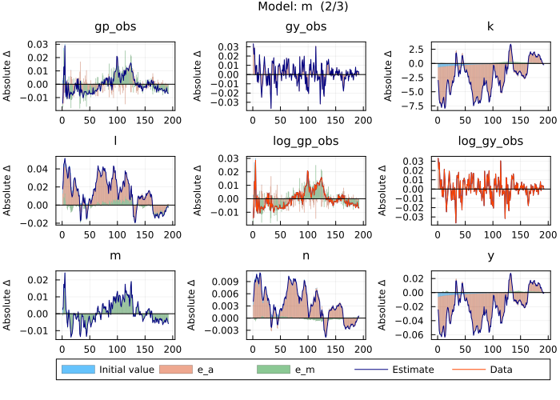

# Calibration / method of moments - Gali (2015)

This tutorial is intended to show the workflow to calibrate a model using method of moments. The tutorial is based on a standard model of monetary policy and will showcase the the use of gradient based optimisers and 2nd and 3rd order pruned solutions.

## Define the model

The first step is always to name the model and write down the equations. For the Gali (2015) model (chapter 3 of the book) this would go as follows:

```@setup tutorial_2
ENV["GKSwstype"] = "100"
using Random
Random.seed!(30)
```

```@repl tutorial_3
using MacroModelling

@model Gali_2015 begin
	W_real[0] = C[0] ^ σ * N[0] ^ φ

	Q[0] = β * (C[1] / C[0]) ^ (-σ) * Z[1] / Z[0] / Pi[1]

	R[0] = 1 / Q[0]

	Y[0] = A[0] * (N[0] / S[0]) ^ (1 - α)

	R[0] = Pi[1] * realinterest[0]

	R[0] = 1 / β * Pi[0] ^ ϕᵖⁱ * (Y[0] / Y[ss]) ^ ϕʸ * exp(nu[0])

	C[0] = Y[0]

	log(A[0]) = ρ_a * log(A[-1]) + std_a * eps_a[x]

	log(Z[0]) = ρ_z * log(Z[-1]) - std_z * eps_z[x]

	nu[0] = ρ_ν * nu[-1] + std_nu * eps_nu[x]

	MC[0] = W_real[0] / (S[0] * Y[0] * (1 - α) / N[0])

	1 = θ * Pi[0] ^ (ϵ - 1) + (1 - θ) * Pi_star[0] ^ (1 - ϵ)

	S[0] = (1 - θ) * Pi_star[0] ^ (( - ϵ) / (1 - α)) + θ * Pi[0] ^ (ϵ / (1 - α)) * S[-1]

	Pi_star[0] ^ (1 + ϵ * α / (1 - α)) = ϵ * x_aux_1[0] / x_aux_2[0] * (1 - τ) / (ϵ - 1)

	x_aux_1[0] = MC[0] * Y[0] * Z[0] * C[0] ^ (-σ) + β * θ * Pi[1] ^ (ϵ + α * ϵ / (1 - α)) * x_aux_1[1]

	x_aux_2[0] = Y[0] * Z[0] * C[0] ^ (-σ) + β * θ * Pi[1] ^ (ϵ - 1) * x_aux_2[1]

	log_y[0] = log(Y[0])

	log_W_real[0] = log(W_real[0])

	log_N[0] = log(N[0])

	pi_ann[0] = 4 * log(Pi[0])

	i_ann[0] = 4 * log(R[0])

	r_real_ann[0] = 4 * log(realinterest[0])

	M_real[0] = Y[0] / R[0] ^ η

end
```

First, we load the package and then use the [`@model`](@ref) macro to define our model. The first argument after [`@model`](@ref) is the model name and will be the name of the object in the global environment containing all information regarding the model. The second argument to the macro are the equations, which we write down between `begin` and `end`. Equations can contain an equality sign or the expression is assumed to equal 0. Equations cannot span multiple lines (unless you wrap the expression in brackets) and the timing of endogenous variables are expressed in the squared brackets following the variable name (e.g. `[-1]` for the past period). Exogenous variables (shocks) are followed by a keyword in squared brackets indicating them being exogenous (in this case `[x]`). Note that names can leverage julia's unicode capabilities (e.g. alpha can be written as α).

## Define the parameters

Next we need to add the parameters of the model. The macro [`@parameters`](@ref) takes care of this:

```@repl tutorial_3
@parameters Gali_2015 begin
	σ = 1

	φ = 5

	ϕᵖⁱ = 1.5
	
	ϕʸ = 0.125

	θ = 0.75

	ρ_ν = 0.5

	ρ_z = 0.5

	ρ_a = 0.9

	β = 0.99

	η = 3.77

	α = 0.25

	ϵ = 9

	τ = 0

    std_a = .01

    std_z = .05

    std_nu = .0025

end
```

The block defining the parameters above only describes the simple parameter definitions the same way you assign values (e.g. `α = .25`).

Note that we have to write one parameter definition per line.

## Inspect model moments

Given the equations and parameters, we have everything to we need for the package to generate the theoretical model moments. You can retrieve the mean of the linearised model as follows:

```@repl tutorial_3
get_mean(Gali_2015)
```

and the standard deviation like this:

```@repl tutorial_3
get_standard_deviation(Gali_2015)
```

You could also simply use: `std` or `get_std` to the same effect.

Another interesting output is the autocorrelation of the model variables, which you can look at by calling:

```@repl tutorial_3
get_autocorrelation(Gali_2015)
```

or the covariance:

```@repl tutorial_3
get_covariance(Gali_2015)
```

## Understand parameter sensitivities

Before embarking on calibrating the model it is useful to get familiar with the impact of parameter changes on model moments. `MacroModelling.jl` provides the partial derivatives of the model moments with respect to the model parameters. The model we are working with is of a medium size and by default derivatives are automatically shown as long as the calculation does not take too long (too many derivatives need to be taken). In this case they are not shown but it is possible to show them by explicitly defining the parameter for which to take the partial derivatives for:

```@repl tutorial_3
get_mean(Gali_2015, parameter_derivatives = :σ)
```

or for multiple parameters:

```@repl tutorial_3
get_mean(Gali_2015, parameter_derivatives = [:σ, :α])
```


only need the data and define the observables to be able to estimate the model.
First, we load in the data from a CSV file (using the CSV and DataFrames packages) and convert it to a `KeyedArray` (using the AxisKeys package). Furthermore, we log transform the data provided in levels, and define the observables of the model. Last but not least we select only those variables in the data which are declared observables in the model.

```@repl tutorial_2
using CSV, DataFrames, AxisKeys

# load data
dat = CSV.read("../assets/FS2000_data.csv", DataFrame)
data = KeyedArray(Array(dat)',Variable = Symbol.("log_".*names(dat)),Time = 1:size(dat)[1])
data = log.(data)

# declare observables
observables = sort(Symbol.("log_".*names(dat)))

# subset observables in data
data = data(observables,:)
```

## Define bayesian model

Next we define the parameter priors using the Turing package. The `@model` macro of the Turing package allows us to define the prior distributions over the parameters and combine it with the loglikelihood of the model and parameters given the data with the help of the `calculate_kalman_filter_loglikelihood` function. Inside the macro we first define the prior distribution and their mean and standard deviation. Note that the `μσ` parameter allows us to hand over the moments (`μ` and `σ`) of the distribution as parameters in case of the non-normal distributions (Gamma, Beta, InverseGamma). Last but not least, we define the loglikelihood and add it to the posterior loglikelihood with the help of the `@addlogprob!` macro.

```@repl tutorial_2
import Turing
import Turing: NUTS, sample, logpdf

Turing.@model function FS2000_loglikelihood_function(data, m, observables)
    alp     ~ Beta(0.356, 0.02, μσ = true)
    bet     ~ Beta(0.993, 0.002, μσ = true)
    gam     ~ Normal(0.0085, 0.003)
    mst     ~ Normal(1.0002, 0.007)
    rho     ~ Beta(0.129, 0.223, μσ = true)
    psi     ~ Beta(0.65, 0.05, μσ = true)
    del     ~ Beta(0.01, 0.005, μσ = true)
    z_e_a   ~ InverseGamma(0.035449, Inf, μσ = true)
    z_e_m   ~ InverseGamma(0.008862, Inf, μσ = true)
    # println([alp, bet, gam, mst, rho, psi, del, z_e_a, z_e_m])
    Turing.@addlogprob! calculate_kalman_filter_loglikelihood(m, data(observables), observables; parameters = [alp, bet, gam, mst, rho, psi, del, z_e_a, z_e_m])
end
```

## Sample from posterior: No-U-Turn Sampler (NUTS)

We use the NUTS sampler to retrieve the posterior distribution of the parameters. This sampler uses the gradient of the posterior loglikelihood with respect to the model parameters to navigate the parameter space. The NUTS sampler is considered robust, fast, and user-friendly (auto-tuning of hyper-parameters).

First we define the loglikelihood model with the specific data, observables, and model. Next, we draw 1000 samples from the model:

```@repl tutorial_2
FS2000_loglikelihood = FS2000_loglikelihood_function(data, FS2000, observables)

n_samples = 1000

chain_NUTS  = sample(FS2000_loglikelihood, NUTS(), n_samples, progress = false);
```

### Inspect posterior

In order to understand the posterior distribution and the sequence of sample we are plot them:

```@repl tutorial_2; setup = :(chain_NUTS = read("../assets/chain_FS2000.jls", Chains))
using StatsPlots
StatsPlots.plot(chain_NUTS);
```


Next, we are plotting the posterior loglikelihood along two parameters dimensions, with the other parameters ket at the posterior mean, and add the samples to the visualisation. This visualisation allows us to understand the curvature of the posterior and puts the samples in context.

```@repl tutorial_2
using ComponentArrays, MCMCChains, DynamicPPL, Plots

parameter_mean = mean(chain_NUTS)
pars = ComponentArray(parameter_mean.nt[2],Axis(parameter_mean.nt[1]))

logjoint(FS2000_loglikelihood, pars)

function calculate_log_probability(par1, par2, pars_syms, orig_pars, model)
    orig_pars[pars_syms] = [par1, par2]
    logjoint(model, orig_pars)
end

granularity = 32;

par1 = :del;
par2 = :gam;
par_range1 = collect(range(minimum(chain_NUTS[par1]), stop = maximum(chain_NUTS[par1]), length = granularity));
par_range2 = collect(range(minimum(chain_NUTS[par2]), stop = maximum(chain_NUTS[par2]), length = granularity));

p = surface(par_range1, par_range2, 
            (x,y) -> calculate_log_probability(x, y, [par1, par2], pars, FS2000_loglikelihood),
            camera=(30, 65),
            colorbar=false,
            color=:inferno);


joint_loglikelihood = [logjoint(FS2000_loglikelihood, ComponentArray(reduce(hcat, get(chain_NUTS, FS2000.parameters)[FS2000.parameters])[s,:], Axis(FS2000.parameters))) for s in 1:length(chain_NUTS)]

scatter3d!(vec(collect(chain_NUTS[par1])),
           vec(collect(chain_NUTS[par2])),
           joint_loglikelihood,
            mc = :viridis, 
            marker_z = collect(1:length(chain_NUTS)), 
            msw = 0,
            legend = false, 
            colorbar = false, 
            xlabel = string(par1),
            ylabel = string(par2),
            zlabel = "Log probability",
            alpha = 0.5);

p
```


## Find posterior mode

Other than the mean and median of the posterior distribution we can also calculate the mode. To this end we will use L-BFGS optimisation routines from the Optim package.

First, we define the posterior loglikelihood function, similar to how we defined it for the Turing model macro.

```@repl tutorial_2
function calculate_posterior_loglikelihood(parameters)
    alp, bet, gam, mst, rho, psi, del, z_e_a, z_e_m = parameters
    log_lik = 0
    log_lik -= calculate_kalman_filter_loglikelihood(FS2000, data(observables), observables; parameters = parameters)
    log_lik -= logpdf(Beta(0.356, 0.02, μσ = true),alp)
    log_lik -= logpdf(Beta(0.993, 0.002, μσ = true),bet)
    log_lik -= logpdf(Normal(0.0085, 0.003),gam)
    log_lik -= logpdf(Normal(1.0002, 0.007),mst)
    log_lik -= logpdf(Beta(0.129, 0.223, μσ = true),rho)
    log_lik -= logpdf(Beta(0.65, 0.05, μσ = true),psi)
    log_lik -= logpdf(Beta(0.01, 0.005, μσ = true),del)
    log_lik -= logpdf(InverseGamma(0.035449, Inf, μσ = true),z_e_a)
    log_lik -= logpdf(InverseGamma(0.008862, Inf, μσ = true),z_e_m)
    return log_lik
end
```

Next, we set up the optimisation problem, parameter bounds, and use the optimizer L-BFGS.

```@repl tutorial_2
using Optim, LineSearches

lbs = [0,0,-10,-10,0,0,0,0,0];
ubs = [1,1,10,10,1,1,1,100,100];

sol = optimize(calculate_posterior_loglikelihood, lbs, ubs , FS2000.parameter_values, Fminbox(LBFGS(linesearch = LineSearches.BackTracking(order = 3))); autodiff = :forward)

sol.minimum
```

## Model estimates given the data and the model solution

Having found the parameters at the posterior mode we can retrieve model estimates of the shocks which explain the data used to estimate it. This can be done with the `get_estimated_shocks` function:

```@repl tutorial_2
get_estimated_shocks(FS2000, data, parameters = sol.minimizer)
```

As the first argument we pass the model, followed by the data (in levels), and then we pass the parameters at the posterior mode. The model is solved with this parameterisation and the shocks are calculated using the Kalman smoother.

We estimated the model on two variables but our model allows us to look at all variables given the data. Looking at the estimated variables can be done using the `get_estimated_variables` function:

```@repl tutorial_2
get_estimated_variables(FS2000, data)
```

Since we already solved the model with the parameters at the posterior mode we do not need to do so again. The function returns a KeyedArray with the values of the variables in levels at each point in time.

Another useful tool is a historical shock decomposition. It allows us to understand the contribution of the shocks for each variable. This can be done using the `get_shock_decomposition` function:

```@repl tutorial_2
get_shock_decomposition(FS2000, data)
```

We get a 3-dimensional array with variables, shocks, and time periods as dimensions. The shocks dimension also includes the initial value as a residual between the actual value and what was explained by the shocks. This computation also relies on the Kalman smoother.

Last but not least, we can also plot the model estimates and the shock decomposition. The model estimates plot, using `plot_model_estimates`:

```@repl tutorial_2
plot_model_estimates(FS2000, data)
```



shows the variables of the model (blue), the estimated shocks (in the last panel), and the data (red) used to estimate the model.

The shock decomposition can be plotted using `plot_shock_decomposition`:

```@repl tutorial_2
plot_shock_decomposition(FS2000, data)
```



and it shows the contribution of the shocks and the contribution of the initial value to the deviations of the variables.
