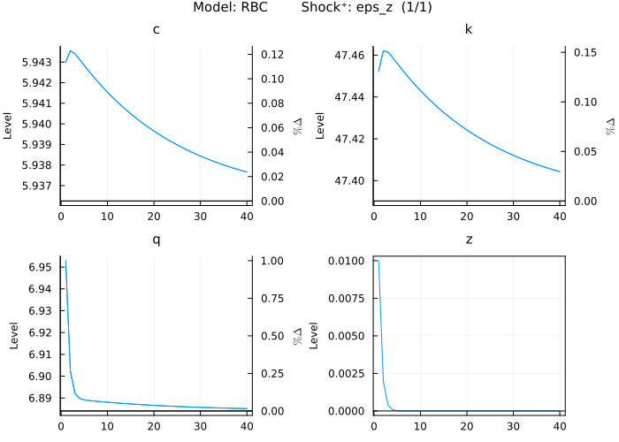
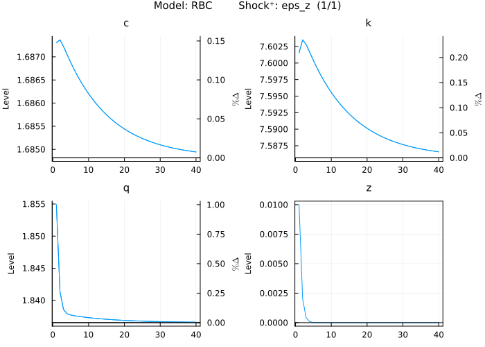
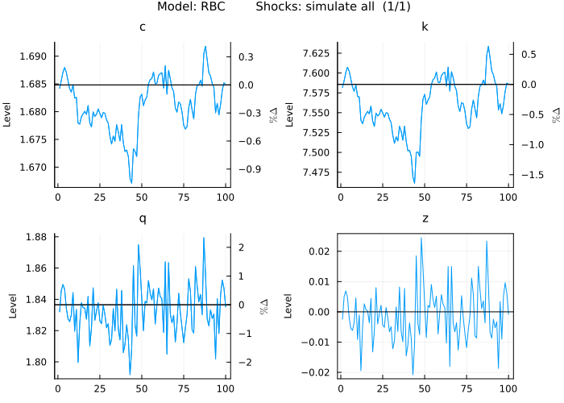
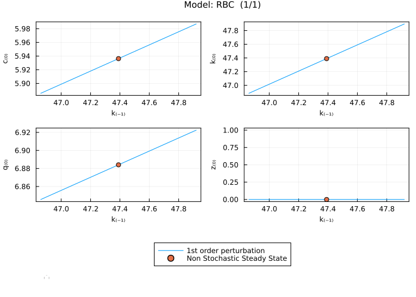

# Write your first model - simple RBC

The following tutorial will walk you through the steps of writing down a model (not explained here / taken as given) and analysing it. Prior knowledge of DSGE models and their solution in practical terms (e.g. having used a mod file with dynare) is useful in understanding this tutorial.

## Define the model

The first step is always to name the model and write down the equations. Taking a standard real business cycle (RBC) model this would go as follows.

First, we load the package and then use the [`@model`](@ref) macro to define our model. The first argument after [`@model`](@ref) is the model name and will be the name of the object in the global environment containing all information regarding the model. The second argument to the macro are the equations, which we write down between `begin` and `end`. One equation per line and timing of endogenous variables are expressed in the squared brackets following the variable name. Exogenous variables (shocks) are followed by a keyword in squared brackets indicating them being exogenous (in this case `[x]`). Note that names can leverage julias unicode capabilities (`alpha` can be written as `α`).

```@setup tutorial_1
ENV["GKSwstype"] = "100"
```

```@repl tutorial_1
using MacroModelling
@model RBC begin
    1  /  c[0] = (β  /  c[1]) * (α * exp(z[1]) * k[0]^(α - 1) + (1 - δ))
    c[0] + k[0] = (1 - δ) * k[-1] + q[0]
    q[0] = exp(z[0]) * k[-1]^α
    z[0] = ρ * z[-1] + std_z * eps_z[x]
end
```

After the model is parsed we get some info on the model variables, and parameters.

## Define the parameters

Next we need to add the parameters of the model. The macro [`@parameters`](@ref) takes care of this:

```@repl tutorial_1
@parameters RBC begin
    std_z = 0.01
    ρ = 0.2
    δ = 0.02
    α = 0.5
    β = 0.95
end
```

Parameter definitions are similar to assigning values in julia. Note that we have to write one parameter definition per line.

## Plot impulse response functions (IRFs)

Given the equations and parameters, we have everything to solve the model and do some analysis. A common output are IRFs for the exogenous shocks. Calling [`plot_irf`](@ref) (different names for the same function are also supported: [`plot_irfs`](@ref), [`plot_IRF`](@ref), or simply [`plot`](@ref)) will take care of this. In the background the package solves (symbolically in this simple case) for the non stochastic steady state (SS) and calculates the first order perturbation solution.

```@repl tutorial_1
plot_irf(RBC)
```



When the model is solved the first time (in this case by calling [`plot_irf`](@ref)), the package breaks down the steady state problem into recursive blocks and first attempts to solve them symbolically and if that fails numerically.

The plot shows the responses of the endogenous variables (`c`, `k`, `q`, and `z`) to a one standard deviation positive (indicated by Shock⁺ in chart title) unanticipated shock in  `eps_z`. Therefore there are as many subplots as there are combinations of shocks and endogenous variables (which are impacted by the shock). Plots are composed of up to 9 subplots and the plot title shows the model name followed by the name of the shock and which plot we are seeing out of the plots for this shock (e.g. (1/3) means we see the first out of three plots for this shock). Subplots show the sorted endogenous variables with the left y-axis showing the level of the respective variable and the right y-axis showing the percent deviation from the SS (if variable is strictly positive). The horizontal black line marks the SS.

## Explore other parameter values

Playing around with the model can be especially insightful in the early phase of model development. The package tries to facilitates this process to the extent possible. Typically one wants to try different parameter values and see how the IRFs change. This can be done by using the `parameters` argument of the [`plot_irf`](@ref) function. We pass a `Pair` with the `Symbol` of the parameter (`:` in front of the parameter name) we want to change and its new value to the `parameter` argument (e.g. `:α => 0.3`).

```@repl tutorial_1
plot_irf(RBC, parameters = :α => 0.3)
```



First, the package finds the new steady state, solves the model dynamics around it and saves the new parameters and solution in the model object. Second, note that the shape of the curves in the plot and the y-axis values changed. Updating the plot for new parameters is significantly faster than calling it the first time. This is because the first call triggers compilations of the model functions, and once compiled the user benefits from the performance of the specialised compiled code.

## Plot model simulation

Another insightful output is simulations of the model. Here we can use the [`plot_simulations`](@ref) function. To the same effect we can use the [`plot`](@ref) function and specify in the `shocks` argument that we want to `:simulate` the model and set the `periods` argument to 100.

```@repl tutorial_1
plot_simulations(RBC)
```



The plots show the models endogenous variables in response to random draws for all exogenous shocks over 100 periods.

## Model statistics

The package solves for the SS automatically and we got an idea of the SS values in the plots. If we want to see the SS values we can call [`get_steady_state`](@ref):

```@repl tutorial_1
get_steady_state(RBC)
```

to get the SS and the derivatives of the SS with respect to the model parameters. The first column of the returned matrix shows the SS while the second to last columns show the derivatives of the SS values (indicated in the rows) with respect to the parameters (indicated in the columns). For example, the derivative of `k` with respect to `β` is 165.319. This means that if we increase `β` by 1, `k` would increase by 165.319 approximately. Let's see how this plays out by changing `β` from 0.95 to 0.951 (a change of +0.001):

```@repl tutorial_1
get_steady_state(RBC,parameters = :β => .951)
```

Note that [`get_steady_state`](@ref) like all other get functions has the `parameters` argument. Hence, whatever output we are looking at we can change the parameters of the model.

The new value of `β` changed the SS as expected and `k` increased by 0.168. The elasticity (0.168/0.001) comes close to the partial derivative previously calculated. The derivatives help understanding the effect of parameter changes on the steady state and make for easier navigation of the parameter space.

### Standard deviations

Next to the SS we can also show the model implied standard deviations of the model. [`get_standard_deviation`](@ref) takes care of this. Additionally we will set the parameter values to what they were in the beginning by passing on a `Tuple` of `Pair`s containing the `Symbol`s of the parameters to be changed and their new (initial) values (e.g. `(:α => 0.5, :β => .95)`).

```@repl tutorial_1
get_standard_deviation(RBC, parameters = (:α => 0.5, :β => .95))
```

The function returns the model implied standard deviations of the model variables and their derivatives with respect to the model parameters. For example, the derivative of the standard deviation of `c` with resect to `δ` is -0.384. In other words, the standard deviation of `c` decreases with increasing `δ`.

### Correlations

Another useful statistic is the model implied correlation of variables. We use [`get_correlation`](@ref) for this:

```@repl tutorial_1
get_correlation(RBC)
```

### Autocorrelations

Last but not least, we have a look at the model implied autocorrelations of model variables using the [`get_autocorrelation`](@ref) function:

```@repl tutorial_1
get_autocorrelation(RBC)
```

## Model solution

A further insightful output are the policy and transition functions of the the first order perturbation solution. To retrieve the solution we call the function [`get_solution`](@ref):

```@repl tutorial_1
get_solution(RBC)
```

The solution provides information about how past states and present shocks impact present variables. The first row contains the SS for the variables denoted in the columns. The second to last rows contain the past states, with the time index `₍₋₁₎`, and present shocks, with exogenous variables denoted by `₍ₓ₎`. For example, the immediate impact of a shock to `eps_z` on `q` is 0.0688.

There is also the possibility to visually inspect the solution using the [`plot_solution`](@ref) function:

```@repl tutorial_1
plot_solution(RBC, :k)
```



The chart shows the first order perturbation solution mapping from the past state `k` to the present variables of the model. The state variable covers a range of two standard deviations around the non stochastic steady state and all other states remain in the non stochastic steady state.

## Obtain array of IRFs or model simulations

Last but not least the user might want to obtain simulated time series of the model or IRFs without plotting them.
For IRFs this is possible by calling [`get_irf`](@ref):

```@repl tutorial_1
get_irf(RBC)
```

which returns a 3-dimensional `KeyedArray` with variables in rows, the period in columns, and the shocks as the third dimension.

For simulations this is possible by calling [`simulate`](@ref):

```@repl tutorial_1
simulate(RBC)
```

which returns the simulated data in a 3-dimensional `KeyedArray` of the same structure as for the IRFs.
