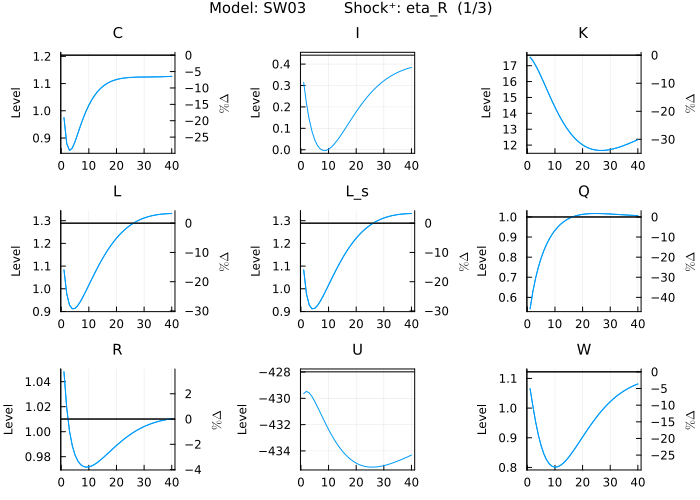
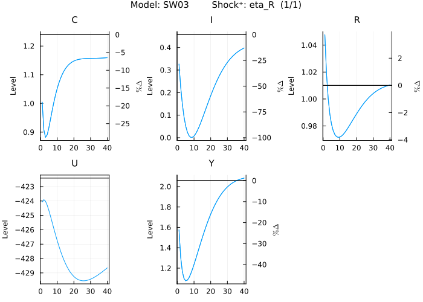
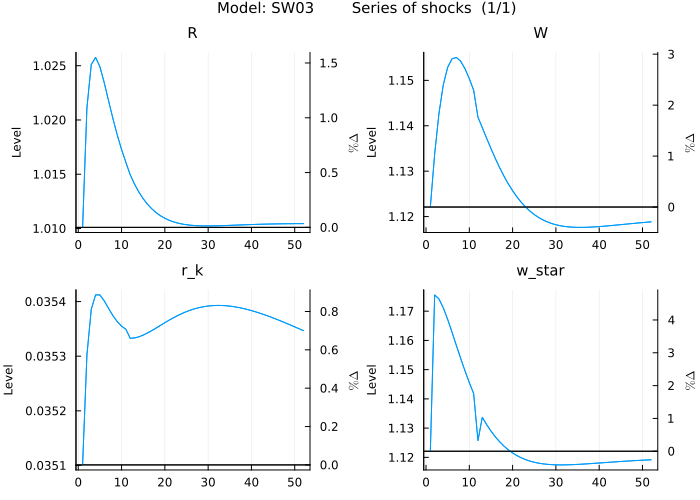
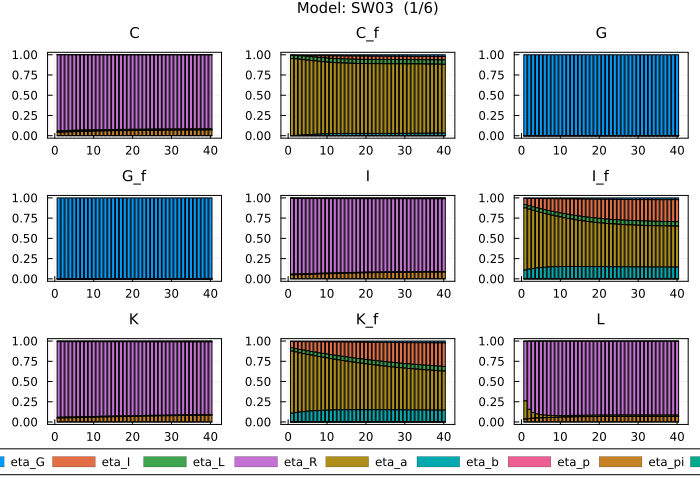
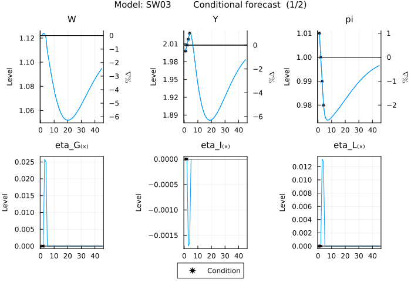

# Work with a complex model - Smets and Wouters (2003)

This tutorial is intended to show more advanced features of the package which come into play with more complex models. The tutorial will walk through the same steps as for the simple RBC model but will use the nonlinear Smets and Wouters (2003) model instead. Prior knowledge of DSGE models and their solution in practical terms (e.g. having used a mod file with dynare) is useful in understanding this tutorial.

## Define the model

The first step is always to name the model and write down the equations. For the Smets and Wouters (2003) model this would go as follows:

```@setup tutorial_2
ENV["GKSwstype"] = "100"
```

```@repl tutorial_2
using MacroModelling
@model SW03 begin
    -q[0] + beta * ((1 - tau) * q[1] + epsilon_b[1] * (r_k[1] * z[1] - psi^-1 * r_k[ss] * (-1 + exp(psi * (-1 + z[1])))) * (C[1] - h * C[0])^(-sigma_c))
    -q_f[0] + beta * ((1 - tau) * q_f[1] + epsilon_b[1] * (r_k_f[1] * z_f[1] - psi^-1 * r_k_f[ss] * (-1 + exp(psi * (-1 + z_f[1])))) * (C_f[1] - h * C_f[0])^(-sigma_c))
    -r_k[0] + alpha * epsilon_a[0] * mc[0] * L[0]^(1 - alpha) * (K[-1] * z[0])^(-1 + alpha)
    -r_k_f[0] + alpha * epsilon_a[0] * mc_f[0] * L_f[0]^(1 - alpha) * (K_f[-1] * z_f[0])^(-1 + alpha)
    -G[0] + T[0]
    -G[0] + G_bar * epsilon_G[0]
    -G_f[0] + T_f[0]
    -G_f[0] + G_bar * epsilon_G[0]
    -L[0] + nu_w[0]^-1 * L_s[0]
    -L_s_f[0] + L_f[0] * (W_i_f[0] * W_f[0]^-1)^(lambda_w^-1 * (-1 - lambda_w))
    L_s_f[0] - L_f[0]
    L_s_f[0] + lambda_w^-1 * L_f[0] * W_f[0]^-1 * (-1 - lambda_w) * (-W_disutil_f[0] + W_i_f[0]) * (W_i_f[0] * W_f[0]^-1)^(-1 + lambda_w^-1 * (-1 - lambda_w))
    Pi_ws_f[0] - L_s_f[0] * (-W_disutil_f[0] + W_i_f[0])
    Pi_ps_f[0] - Y_f[0] * (-mc_f[0] + P_j_f[0]) * P_j_f[0]^(-lambda_p^-1 * (1 + lambda_p))
    -Q[0] + epsilon_b[0]^-1 * q[0] * (C[0] - h * C[-1])^(sigma_c)
    -Q_f[0] + epsilon_b[0]^-1 * q_f[0] * (C_f[0] - h * C_f[-1])^(sigma_c)
    -W[0] + epsilon_a[0] * mc[0] * (1 - alpha) * L[0]^(-alpha) * (K[-1] * z[0])^alpha
    -W_f[0] + epsilon_a[0] * mc_f[0] * (1 - alpha) * L_f[0]^(-alpha) * (K_f[-1] * z_f[0])^alpha
    -Y_f[0] + Y_s_f[0]
    Y_s[0] - nu_p[0] * Y[0]
    -Y_s_f[0] + Y_f[0] * P_j_f[0]^(-lambda_p^-1 * (1 + lambda_p))
    beta * epsilon_b[1] * (C_f[1] - h * C_f[0])^(-sigma_c) - epsilon_b[0] * R_f[0]^-1 * (C_f[0] - h * C_f[-1])^(-sigma_c)
    beta * epsilon_b[1] * pi[1]^-1 * (C[1] - h * C[0])^(-sigma_c) - epsilon_b[0] * R[0]^-1 * (C[0] - h * C[-1])^(-sigma_c)
    Y_f[0] * P_j_f[0]^(-lambda_p^-1 * (1 + lambda_p)) - lambda_p^-1 * Y_f[0] * (1 + lambda_p) * (-mc_f[0] + P_j_f[0]) * P_j_f[0]^(-1 - lambda_p^-1 * (1 + lambda_p))
    epsilon_b[0] * W_disutil_f[0] * (C_f[0] - h * C_f[-1])^(-sigma_c) - omega * epsilon_b[0] * epsilon_L[0] * L_s_f[0]^sigma_l
    -1 + xi_p * (pi[0]^-1 * pi[-1]^gamma_p)^(-lambda_p^-1) + (1 - xi_p) * pi_star[0]^(-lambda_p^-1)
    -1 + (1 - xi_w) * (w_star[0] * W[0]^-1)^(-lambda_w^-1) + xi_w * (W[-1] * W[0]^-1)^(-lambda_w^-1) * (pi[0]^-1 * pi[-1]^gamma_w)^(-lambda_w^-1)
    -Phi - Y_s[0] + epsilon_a[0] * L[0]^(1 - alpha) * (K[-1] * z[0])^alpha
    -Phi - Y_f[0] * P_j_f[0]^(-lambda_p^-1 * (1 + lambda_p)) + epsilon_a[0] * L_f[0]^(1 - alpha) * (K_f[-1] * z_f[0])^alpha
    std_eta_b * eta_b[x] - log(epsilon_b[0]) + rho_b * log(epsilon_b[-1])
    -std_eta_L * eta_L[x] - log(epsilon_L[0]) + rho_L * log(epsilon_L[-1])
    std_eta_I * eta_I[x] - log(epsilon_I[0]) + rho_I * log(epsilon_I[-1])
    std_eta_w * eta_w[x] - f_1[0] + f_2[0]
    std_eta_a * eta_a[x] - log(epsilon_a[0]) + rho_a * log(epsilon_a[-1])
    std_eta_p * eta_p[x] - g_1[0] + g_2[0] * (1 + lambda_p)
    std_eta_G * eta_G[x] - log(epsilon_G[0]) + rho_G * log(epsilon_G[-1])
    -f_1[0] + beta * xi_w * f_1[1] * (w_star[0]^-1 * w_star[1])^(lambda_w^-1) * (pi[1]^-1 * pi[0]^gamma_w)^(-lambda_w^-1) + epsilon_b[0] * w_star[0] * L[0] * (1 + lambda_w)^-1 * (C[0] - h * C[-1])^(-sigma_c) * (w_star[0] * W[0]^-1)^(-lambda_w^-1 * (1 + lambda_w))
    -f_2[0] + beta * xi_w * f_2[1] * (w_star[0]^-1 * w_star[1])^(lambda_w^-1 * (1 + lambda_w) * (1 + sigma_l)) * (pi[1]^-1 * pi[0]^gamma_w)^(-lambda_w^-1 * (1 + lambda_w) * (1 + sigma_l)) + omega * epsilon_b[0] * epsilon_L[0] * (L[0] * (w_star[0] * W[0]^-1)^(-lambda_w^-1 * (1 + lambda_w)))^(1 + sigma_l)
    -g_1[0] + beta * xi_p * pi_star[0] * g_1[1] * pi_star[1]^-1 * (pi[1]^-1 * pi[0]^gamma_p)^(-lambda_p^-1) + epsilon_b[0] * pi_star[0] * Y[0] * (C[0] - h * C[-1])^(-sigma_c)
    -g_2[0] + beta * xi_p * g_2[1] * (pi[1]^-1 * pi[0]^gamma_p)^(-lambda_p^-1 * (1 + lambda_p)) + epsilon_b[0] * mc[0] * Y[0] * (C[0] - h * C[-1])^(-sigma_c)
    -nu_w[0] + (1 - xi_w) * (w_star[0] * W[0]^-1)^(-lambda_w^-1 * (1 + lambda_w)) + xi_w * nu_w[-1] * (W[-1] * pi[0]^-1 * W[0]^-1 * pi[-1]^gamma_w)^(-lambda_w^-1 * (1 + lambda_w))
    -nu_p[0] + (1 - xi_p) * pi_star[0]^(-lambda_p^-1 * (1 + lambda_p)) + xi_p * nu_p[-1] * (pi[0]^-1 * pi[-1]^gamma_p)^(-lambda_p^-1 * (1 + lambda_p))
    -K[0] + K[-1] * (1 - tau) + I[0] * (1 - 0.5 * varphi * (-1 + I[-1]^-1 * epsilon_I[0] * I[0])^2)
    -K_f[0] + K_f[-1] * (1 - tau) + I_f[0] * (1 - 0.5 * varphi * (-1 + I_f[-1]^-1 * epsilon_I[0] * I_f[0])^2)
    U[0] - beta * U[1] - epsilon_b[0] * ((1 - sigma_c)^-1 * (C[0] - h * C[-1])^(1 - sigma_c) - omega * epsilon_L[0] * (1 + sigma_l)^-1 * L_s[0]^(1 + sigma_l))
    U_f[0] - beta * U_f[1] - epsilon_b[0] * ((1 - sigma_c)^-1 * (C_f[0] - h * C_f[-1])^(1 - sigma_c) - omega * epsilon_L[0] * (1 + sigma_l)^-1 * L_s_f[0]^(1 + sigma_l))
    -epsilon_b[0] * (C[0] - h * C[-1])^(-sigma_c) + q[0] * (1 - 0.5 * varphi * (-1 + I[-1]^-1 * epsilon_I[0] * I[0])^2 - varphi * I[-1]^-1 * epsilon_I[0] * I[0] * (-1 + I[-1]^-1 * epsilon_I[0] * I[0])) + beta * varphi * I[0]^-2 * epsilon_I[1] * q[1] * I[1]^2 * (-1 + I[0]^-1 * epsilon_I[1] * I[1])
    -epsilon_b[0] * (C_f[0] - h * C_f[-1])^(-sigma_c) + q_f[0] * (1 - 0.5 * varphi * (-1 + I_f[-1]^-1 * epsilon_I[0] * I_f[0])^2 - varphi * I_f[-1]^-1 * epsilon_I[0] * I_f[0] * (-1 + I_f[-1]^-1 * epsilon_I[0] * I_f[0])) + beta * varphi * I_f[0]^-2 * epsilon_I[1] * q_f[1] * I_f[1]^2 * (-1 + I_f[0]^-1 * epsilon_I[1] * I_f[1])
    std_eta_pi * eta_pi[x] - log(pi_obj[0]) + rho_pi_bar * log(pi_obj[-1]) + log(calibr_pi_obj) * (1 - rho_pi_bar)
    -C[0] - I[0] - T[0] + Y[0] - psi^-1 * r_k[ss] * K[-1] * (-1 + exp(psi * (-1 + z[0])))
    -calibr_pi + std_eta_R * eta_R[x] - log(R[ss]^-1 * R[0]) + r_Delta_pi * (-log(pi[ss]^-1 * pi[-1]) + log(pi[ss]^-1 * pi[0])) + r_Delta_y * (-log(Y[ss]^-1 * Y[-1]) + log(Y[ss]^-1 * Y[0]) + log(Y_f[ss]^-1 * Y_f[-1]) - log(Y_f[ss]^-1 * Y_f[0])) + rho * log(R[ss]^-1 * R[-1]) + (1 - rho) * (log(pi_obj[0]) + r_pi * (-log(pi_obj[0]) + log(pi[ss]^-1 * pi[-1])) + r_Y * (log(Y[ss]^-1 * Y[0]) - log(Y_f[ss]^-1 * Y_f[0])))
    -C_f[0] - I_f[0] + Pi_ws_f[0] - T_f[0] + Y_f[0] + L_s_f[0] * W_disutil_f[0] - L_f[0] * W_f[0] - psi^-1 * r_k_f[ss] * K_f[-1] * (-1 + exp(psi * (-1 + z_f[0])))
    epsilon_b[0] * (K[-1] * r_k[0] - r_k[ss] * K[-1] * exp(psi * (-1 + z[0]))) * (C[0] - h * C[-1])^(-sigma_c)
    epsilon_b[0] * (K_f[-1] * r_k_f[0] - r_k_f[ss] * K_f[-1] * exp(psi * (-1 + z_f[0]))) * (C_f[0] - h * C_f[-1])^(-sigma_c)
end
```

First, we load the package and then use the [`@model`](@ref) macro to define our model. The first argument after [`@model`](@ref) is the model name and will be the name of the object in the global environment containing all information regarding the model. The second argument to the macro are the equations, which we write down between begin and end. Equations can contain an equality sign or the expression is assumed to equal 0. Equations cannot span multiple lines and the timing of endogenous variables are expressed in the squared brackets following the variable name (e.g. `[-1]` for the past period). Exogenous variables (shocks) are followed by a keyword in squared brackets indicating them being exogenous (in this case [x]). In this example there are also variables in the non stochastic steady state denoted by `[ss]`. Note that names can leverage julia's unicode capabilities (alpha can be written as α).

## Define the parameters

Next we need to add the parameters of the model. The macro [`@parameters`](@ref) takes care of this:

```@repl tutorial_2
@parameters SW03 begin  
    lambda_p = .368
    G_bar = .362
    lambda_w = 0.5
    Phi = .819

    alpha = 0.3
    beta = 0.99
    gamma_w = 0.763
    gamma_p = 0.469
    h = 0.573
    omega = 1
    psi = 0.169

    r_pi = 1.684
    r_Y = 0.099
    r_Delta_pi = 0.14
    r_Delta_y = 0.159

    sigma_c = 1.353
    sigma_l = 2.4
    tau = 0.025
    varphi = 6.771
    xi_w = 0.737
    xi_p = 0.908

    rho = 0.961
    rho_b = 0.855
    rho_L = 0.889
    rho_I = 0.927
    rho_a = 0.823
    rho_G = 0.949
    rho_pi_bar = 0.924

    std_eta_b = 0.336
    std_eta_L = 3.52
    std_eta_I = 0.085
    std_eta_a = 0.598
    std_eta_w = 0.6853261
    std_eta_p = 0.7896512
    std_eta_G = 0.325
    std_eta_R = 0.081
    std_eta_pi = 0.017

    calibr_pi_obj | 1 = pi_obj[ss]
    calibr_pi | pi[ss] = pi_obj[ss]
end
```

The block defining the parameters above has three different inputs.

First, there are simple parameter definition the same way you assign values (e.g. `Phi = .819`).

Second, there are calibration equations where we treat the value of a parameter as unknown (e.g. `calibr_pi_obj`) and want an additional equation to hold (e.g. `1 = pi_obj[ss]`). The additional equation can contain variables in SS or parameters. Putting it together a calibration equation is defined by the unknown parameter, and the calibration equation, separated by `|` (e.g. `calibr_pi_obj | 1 = pi_obj[ss]` and also `1 = pi_obj[ss] | calibr_pi_obj`).

<!-- Third, information about the domain of variables and parameters are passed on (e.g. `0 < C`). This is useful information for the symbolic and numerical solvers of the SS. -->

Note that we have to write one parameter definition per line.

## Plot impulse response functions (IRFs)

Given the equations and parameters, we have everything to solve the model and do some analysis. A common output are IRFs for the exogenous shocks. Calling [`plot_irf`](@ref) (different names for the same function are also supported: [`plot_irfs`](@ref), [`plot_IRF`](@ref), or simply [`plot`](@ref)) will take care of this. In the background the package solves (numerically in this complex case) for the non stochastic steady state (SS) and calculates the first order perturbation solution.

```@repl tutorial_2
plot_irf(SW03)
```



When the model is solved the first time (in this case by calling [`plot_irf`](@ref)), the package breaks down the steady state problem into independent blocks and first attempts to solve them symbolically and if that fails numerically.

The plots show the responses of the endogenous variables to a one standard deviation positive (indicated by Shock⁺ in chart title) unanticipated shock. Therefore there are as many subplots as there are combinations of shocks and endogenous variables (which are impacted by the shock). Plots are composed of up to 9 subplots and the plot title shows the model name followed by the name of the shock and which plot we are seeing out of the plots for this shock (e.g. (1/3) means we see the first out of three plots for this shock). Subplots show the sorted endogenous variables with the left y-axis showing the level of the respective variable and the right y-axis showing the percent deviation from the SS (if variable is strictly positive). The horizontal black line marks the SS.

## Explore other parameter values

Playing around with the model can be especially insightful in the early phase of model development. The package tries to facilitate this process to the extent possible. Typically one wants to try different parameter values and see how the IRFs change. This can be done by using the `parameters` argument of the [`plot_irf`](@ref) function. We pass a `Pair` with the `Symbol` of the parameter (`:` in front of the parameter name) we want to change and its new value to the `parameter` argument (e.g. `:alpha => 0.305`). Furthermore, we want to focus on certain shocks and variables. We select for the example the `eta_R` shock by passing it as a `Symbol` to the `shocks` argument of the [`plot_irf`](@ref) function. For the variables we choose to plot: `U`, `Y`, `I`, `R`, and `C` and achieve that by passing the `Vector` of `Symbol`s to the `variables` argument of the [`plot_irf`](@ref) function:

```@repl tutorial_2
plot_irf(SW03, 
         parameters = :alpha => 0.305, 
         variables = [:U,:Y,:I,:R,:C], 
         shocks = :eta_R)
```



First, the package finds the new steady state, solves the model dynamics around it and saves the new parameters and solution in the model object. Second, note that with the parameters the IRFs changed (e.g. compare the y-axis values for `U`). Updating the plot for new parameters is significantly faster than calling it the first time. This is because the first call triggers compilations of the model functions, and once compiled the user benefits from the performance of the specialised compiled code. Furthermore, finding the SS from a valid SS as a starting point is faster.

## Plot model simulation

Another insightful output is simulations of the model. Here we can use the [`plot_simulations`](@ref) function. Again we want to only look at a subset of the variables and specify it in the `variables` argument. To the same effect we can use the [`plot_irf`](@ref) function and specify in the `shocks` argument that we want to `:simulate` the model and set the `periods` argument to 100.

```@repl tutorial_2
plot_simulations(SW03, variables = [:U,:Y,:I,:R,:C])
```


The plots show the models endogenous variables in response to random draws for all exogenous shocks over 100 periods.

## Plot specific series of shocks

Sometimes one has a specific series of shocks in mind and wants to see the corresponding model response of endogenous variables. This can be achieved by passing a `Matrix` or `KeyedArray` of the series of shocks to the `shocks` argument of the [`plot`](@ref) function. Let's assume there is a positive 1 standard deviation shock to `eta_b` in period 2 and a negative 1 standard deviation shock to `eta_w` in period 12. This can be implemented as follows:

```@repl tutorial_2
using AxisKeys
shock_series = KeyedArray(zeros(2,12), Shocks = [:eta_b, :eta_w], Periods = 1:12)
shock_series[1,2] = 1
shock_series[2,12] = -1
plot(SW03, shocks = shock_series, variables = [:W,:r_k,:w_star,:R])
```



First, we construct the `KeyedArray` containing the series of shocks and pass it to the `shocks` argument.
The plot shows the paths of the selected variables for the two shocks hitting the economy in periods 2 and 12 and 40 quarters thereafter.

## Model statistics

### Steady state

The package solves for the SS automatically and we got an idea of the SS values in the plots. If we want to see the SS values and the derivatives of the SS with respect to the model parameters we can call [`get_steady_state`](@ref). The model has 39 parameters and 54 variables. Since we are not interested in all derivatives for all parameters we select a subset. This can be done by passing on a `Vector` of `Symbol`s of the parameters to the `parameter_derivatives` argument:

```@repl tutorial_2
get_steady_state(SW03, parameter_derivatives = [:alpha,:beta])
```

The first column of the returned matrix shows the SS while the second to last columns show the derivatives of the SS values (indicated in the rows) with respect to the parameters (indicated in the columns). For example, the derivative of `C` with respect to `beta` is 14.4994. This means that if we increase `beta` by 1, `C` would increase by 14.4994 approximately. Let's see how this plays out by changing `beta` from 0.99 to 0.991 (a change of +0.001):

```@repl tutorial_2
get_steady_state(SW03, 
                 parameter_derivatives = [:alpha,:G_bar], 
                 parameters = :beta => .991)
```

Note that [`get_steady_state`](@ref) like all other get functions has the `parameters` argument. Hence, whatever output we are looking at we can change the parameters of the model.

The new value of `beta` changed the SS as expected and `C` increased by 0.01465. The elasticity (0.01465/0.001) comes close to the partial derivative previously calculated. The derivatives help understanding the effect of parameter changes on the steady state and make for easier navigation of the parameter space.

### Standard deviations

Next to the SS we can also show the model implied standard deviations of the model. [`get_standard_deviation`](@ref) takes care of this. Additionally we will set the parameter values to what they were in the beginning by passing on a `Tuple` of `Pair`s containing the `Symbol`s of the parameters to be changed and their new (initial) values (e.g. `(:alpha => 0.3, :beta => .99)`).

```@repl tutorial_2
get_standard_deviation(SW03, 
                       parameter_derivatives = [:alpha,:beta], 
                       parameters = (:alpha => 0.3, :beta => .99))
```

The function returns the model implied standard deviations of the model variables and their derivatives with respect to the model parameters. For example, the derivative of the standard deviation of `q` with resect to `alpha` is -19.0184. In other words, the standard deviation of `q` decreases with increasing `alpha`.

### Correlations

Another useful statistic is the model implied correlation of variables. We use [`get_correlation`](@ref) for this:

```@repl tutorial_2
get_correlation(SW03)
```

### Autocorrelations

Next, we have a look at the model implied aautocorrelations of model variables using the [`get_autocorrelation`](@ref) function:

```@repl tutorial_2
get_autocorrelation(SW03)
```

### Variance decomposition

The model implied contribution of each shock to the variance of the model variables can be calculate by using the  [`get_variance_decomposition`](@ref) function:

```@repl tutorial_2
get_variance_decomposition(SW03)
```

### Conditional variance decomposition

Last but not least, we have look at the model implied contribution of each shock per period to the variance of the model variables (also called forecast error variance decomposition) by using the  [`get_conditional_variance_decomposition`](@ref) function:

```@repl tutorial_2
get_conditional_variance_decomposition(SW03)
```

### Plot conditional variance decomposition

Especially for the conditional variance decomposition it is convenient to look at a plot instead of the raw numbers. This can be done using the [`plot_conditional_variance_decomposition`](@ref) function:

```@repl tutorial_2
plot_conditional_variance_decomposition(SW03, variables = [:U,:Y,:I,:R,:C])
```



## Model solution

A further insightful output are the policy and transition functions of the the first order perturbation solution. To retrieve the solution we call the function [`get_solution`](@ref):

```@repl tutorial_2
get_solution(SW03)
```

The solution provides information about how past states and present shocks impact present variables. The first row contains the SS for the variables denoted in the columns. The second to last rows contain the past states, with the time index `₍₋₁₎`, and present shocks, with exogenous variables denoted by `₍ₓ₎`. For example, the immediate impact of a shock to `eta_w` on `z` is 0.00222469.

There is also the possibility to visually inspect the solution using the [`plot_solution`](@ref) function:

```@repl tutorial_2
plot_solution(SW03, :pi, variables = [:C, :I,:K,:L])
```


The chart shows the first order perturbation solution mapping from the past state `pi` to the present variables `C`, `I`, `K`, and `L`. The state variable covers a range of two standard deviations around the non stochastic steady state and all other states remain in the non stochastic steady state.

## Obtain array of IRFs or model simulations

Last but not least the user might want to obtain simulated time series of the model or IRFs without plotting them.
For IRFs this is possible by calling [`get_irf`](@ref):

```@repl tutorial_2
get_irf(SW03)
```

which returns a 3-dimensional `KeyedArray` with variables in rows, the period in columns, and the shocks as the third dimension.

For simulations this is possible by calling [`simulate`](@ref):

```@repl tutorial_2
simulate(SW03)
```

which returns the simulated data in a 3-dimensional `KeyedArray` of the same structure as for the IRFs.

## Conditional forecasts

Conditional forecasting is a useful tool to incorporate for example forecasts into a model and then add shocks on top.

For example we might be interested in the model dynamics given a path for `Y` and `pi` for the first 4 quarters and the next quarter a negative shock to `eta_w` arrives. Furthermore, we want that the first two periods only a subset of shocks is used to match the conditions on the endogenous variables. This can be implemented using the `get_conditional_forecast` function and visualised with the `plot_conditional_forecast` function.

First, we define the conditions on the endogenous variables as deviations from the non stochastic steady state (`Y` and `pi` in this case) using a `KeyedArray` from the `AxisKeys` package (check [`get_conditional_forecast`](@ref) for other ways to define the conditions):

```@repl tutorial_2
using AxisKeys
conditions = KeyedArray(Matrix{Union{Nothing,Float64}}(undef,2,4),Variables = [:Y, :pi], Periods = 1:4)
conditions[1,1:4] .= [-.01,0,.01,.02]
conditions[2,1:4] .= [.01,0,-.01,-.02]
```

Note that all other endogenous variables not part of the `KeyedArray` are also not conditioned on.

Next, we define the conditions on the shocks using a `Matrix` (check [`get_conditional_forecast`](@ref) for other ways to define the conditions on the shocks):

```@repl tutorial_2
shocks = Matrix{Union{Nothing,Float64}}(undef,9,5)
shocks[[1:3...,5,9],1:2] .= 0
shocks[9,5] = -1
```

The above shock `Matrix` means that for the first two periods shocks 1, 2, 3, 5, and 9 are fixed at zero and in the fifth period there is a negative shock of `eta_w` (the 9th shock).

Finally we can get the conditional forecast:

```@repl tutorial_2
get_conditional_forecast(SW03, conditions, shocks = shocks, variables = [:Y,:pi,:C,:W])
```

The function returns a `KeyedArray` with the values of the endogenous variables and shocks matching the conditions exactly.

We can also plot the conditional forecast using:

```@repl tutorial_2
plot_conditional_forecast(SW03, conditions, shocks = shocks, variables = [:Y,:pi,:C,:W])
```

<!--  -->

Note that the stars indicate the values the model is conditioned on.
